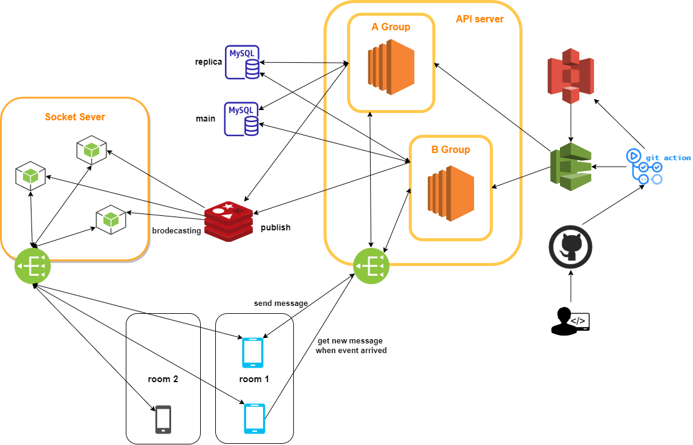
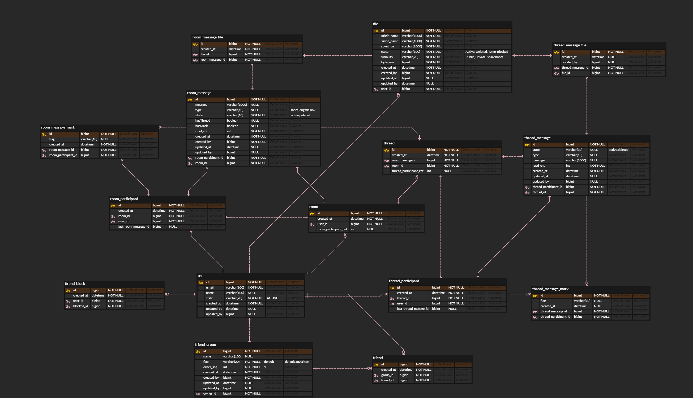

# [Toy Project] simple-chat-api 
현재 구상중..

- 간단한 채팅 서버
- 유저 클라이언트 제외 

## Tech stack 
현재 구상중.. 🤔
 
1. api server 
    - spring boot mvc 
    - spring validator 
    - spring actuator
    - spring data jpa
    - querydsl
    - mapstruct
    - h2, mysql
        - mysql replication (try? nope) 
    - spring data redis
    - nginx : RR
2. socket server
    - node + express
    - socket.io
    - nginx : stick
3. Redis
    - Cluster (try? nope) 
4. Github Repo + Action, Codedeploy
5. NoSQL(Try to manage chat messages by NoSQL? nope) 

## 아키텍처 설계
현재 구상중..
- websocekt + redis 는 event 신호 정도만 전달 
 

### 고려사항
1. socket.io max connection per node and server
2. socket.io max room per namespace
3. pm2 or docker for node - 어떤 방식을 할지... 
4. docker or not for spring - 어떤 방식을 할지...
5. nginx stick session max connection   
6. api server 부하 테스트 jmeter? ngrinder? 
7. 디비 테이블 별 소프트 fk와 물리 fk 결정
8. 디비 테이블 별 소프트 삭제와 물리 삭제 결정, casecade도 같이 고려
9. message 테이블은 record가 엄청 많을건데... 어떻게 관리하지? table 파티션? nosql scale out? 

## ERD
현재 구상중..

## Version History

### API Server Version 0
    
1. user api
    - sign up
    - delete 
    - get me 
     
2. token api
    - issue access token by credentials
    - issue access token by refresh token
3. friends group
    - group
        - create
        - delete
        - friends
            - add
            - delete
            - block
4. room api
    - open
    - invite friends
    - message
        - send
        - receive
        - mark
            - create
            - cancel
5. thread api
    - open
    - message
        - send
        - receive
        - mark
            - create
            - cancel

6. redis 연동

### Socket Server Version 0
socket 서버는 이벤트 전파 역할만 하므로 많은 기능이 없다.

1. socket.io connection with jwt 
2. socket.io client 연결
2. redis 연동